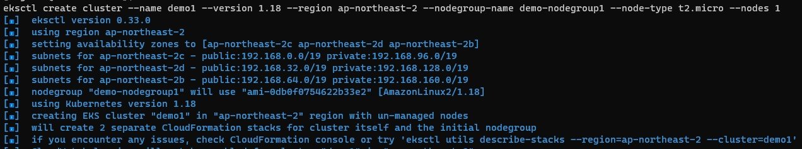
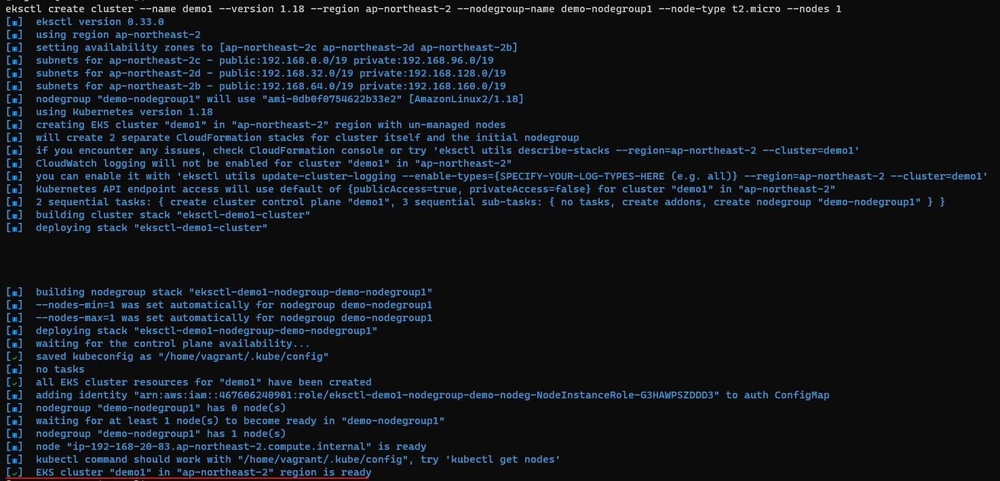

# 1. 개요
* eksctl 명령어 실행 과정을 기록
* <b>시간이 매우 오래 소요(10~20분)</b>

<br>

# 2. 실행 과정
## 2.1 eksctl 명령어 실행


<br> 설치 중

<br>


<br> 설치 끝

<br>

## 2.2 설치 확인
```sh
eksctl get cluster
```

<br>

# 3. 삭제
```
eksctl delete cluster --name [클러스터 이름]
```
